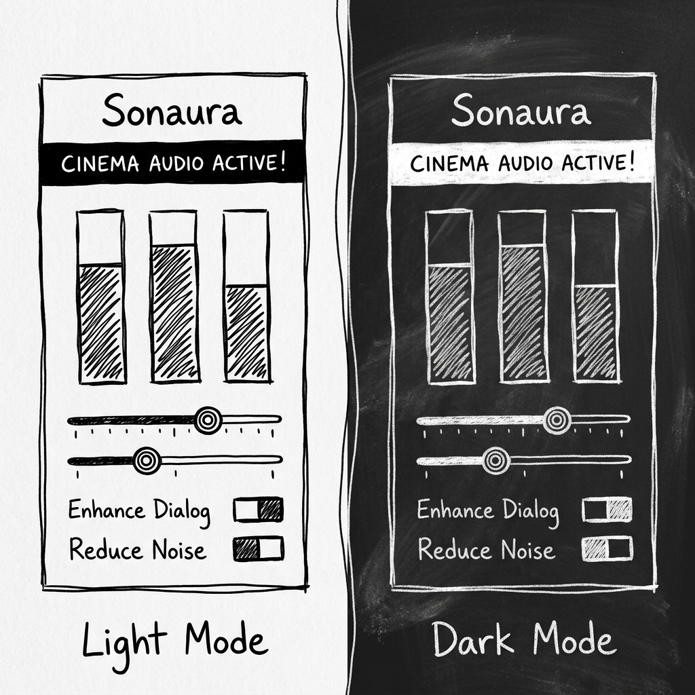
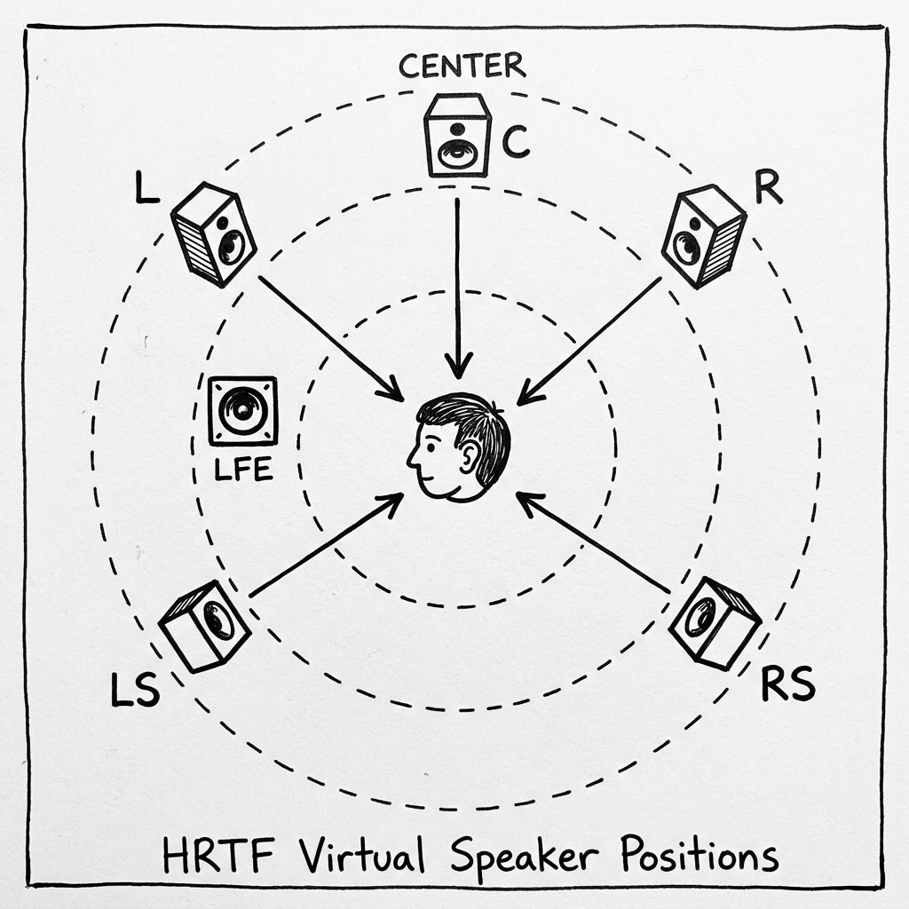
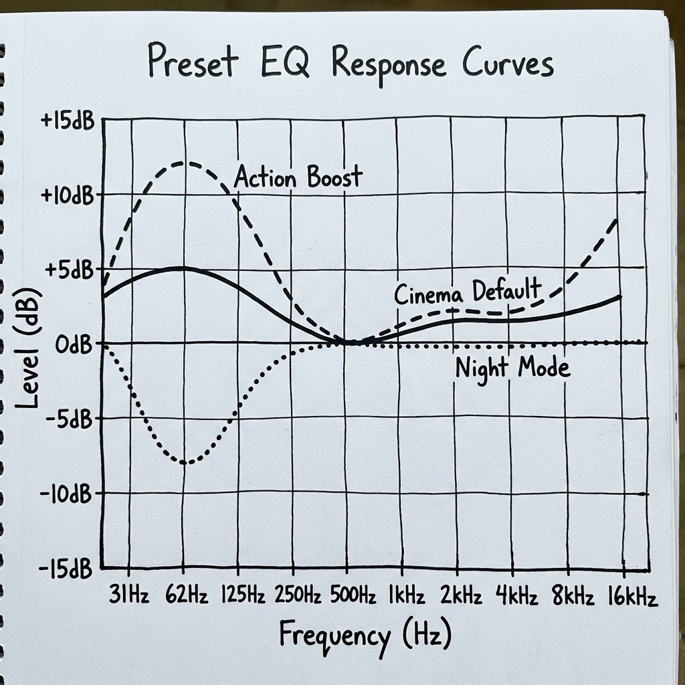
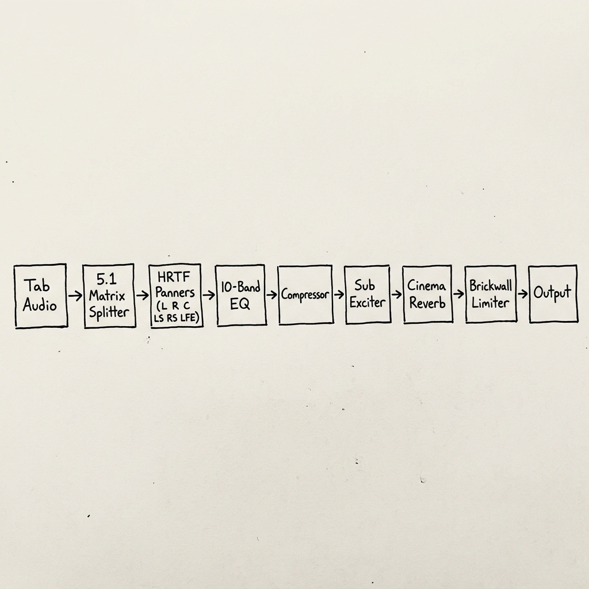

<div align="center">


<br/><br/>


<br/><br/>

**A hand-drawn audio console that lives inside your browser.**<br/>
**Virtualized 5.1 surround. Cinema hall reverb. Sub-bass excitation. Brickwall limiting.**<br/>
**All rendered in real-time through the Web Audio API.**

<br/>

[](https://github.com)
[](https://developer.chrome.com/docs/extensions/mv3/)
[](https://developer.mozilla.org/en-US/docs/Web/API/Web_Audio_API)
[](LICENSE)

</div>

---

<br/>

## What is Sonaura?

Every streaming platform -- YouTube, Netflix, Disney+, Spotify, Prime Video -- ships audio as flat stereo. Two channels. Left and right. That's it.

Your headphones are capable of so much more.

**Sonaura 2.0** intercepts the raw audio stream from any Chrome tab, runs it through a professional-grade digital signal processing pipeline, and outputs cinema-quality virtualized 5.1 surround sound through your existing headphones or speakers.

No external software. No system drivers. No subscriptions. One click. One extension. A completely different listening experience.

<br/>


## The Interface

Sonaura's UI is drawn like a page torn from an engineer's notebook. No gradients. No glassmorphism. Just ink on paper. It ships with two themes:

<div align="center">

</div>

<br/>

| Theme | Aesthetic | Background | Strokes |
|:------|:----------|:-----------|:--------|
| **Light Mode** | Felt-tip pen sketch | Clean white paper | Black ink outlines |
| **Dark Mode** | Chalk on blackboard | Dark charcoal grey | White chalk strokes |

The toggle is in the header. Your choice persists across sessions. If you don't pick one, Sonaura follows your operating system's preferred color scheme.

<br/>

---

<br/>

## Features

<br/>

### HRTF 5.1 Virtual Surround

Stereo audio is split into six discrete channels -- Front Left, Front Right, Center, Left Surround, Right Surround, and LFE -- each positioned in 3D space using HRTF (Head-Related Transfer Function) binaural panners. The result: your headphones simulate a real theater.

<div align="center">

</div>

<br/>

The surround matrix uses decorrelated Haas-effect delays (22ms left, 28ms right) and high-frequency absorption filters at 7500 Hz on the rear channels to simulate the natural acoustic behavior of sound arriving from behind the listener.

A dedicated center channel extracts dialogue through a 120 Hz highpass and a 2 kHz peaking filter (+2.5 dB) to guarantee vocal clarity above the mix.

The **Surround Stage Width** slider controls how far apart the virtual speakers are placed. At 1.0x, it matches a standard ITU 5.1 layout. At 5.0x, the stage is enormous.

| Channel | Position | Angle | Special Processing |
|:--------|:---------|:------|:-------------------|
| **L** | Front Left | ~30 degrees | Direct path |
| **R** | Front Right | ~330 degrees | Direct path |
| **C** | Center | 0 degrees | Highpass 120 Hz + Peaking 2 kHz |
| **LS** | Left Surround | ~110 degrees | Delay 22ms + Lowpass 7500 Hz |
| **RS** | Right Surround | ~250 degrees | Delay 28ms + Lowpass 7500 Hz |
| **LFE** | Subwoofer | Omnidirectional | Lowpass 120 Hz |

<br/>

---

### Cinema Hall Reverb

A synthetic convolution reverb simulates the reflective acoustics of a mid-sized movie theater.

| Parameter | Value |
|:----------|:------|
| **Duration** | 0.55 seconds |
| **Attack** | 15ms linear ramp |
| **Plateau** | 65ms sustain |
| **Decay** | Exponential, factor 7.5 |
| **Stereo Field** | Decorrelated L/R noise with asymmetric lowpass |
| **Cross-Talk** | Haas simulation at 2.5ms inter-channel delay |
| **Wet/Dry Mix** | Adjustable per-preset (default 50%) |
| **Highpass** | 150 Hz (prevents reverb mud) |
| **Lowpass** | 4500 Hz (simulates absorption) |

You can also upload your own `.wav` impulse response files. Record a concert hall. Sample a cathedral. Drop a `.wav` and Sonaura will convolve your browser audio through that space in real-time.

<br/>

---

### 10-Band Parametric Equalizer

| Band | Frequency | Type | Q |
|:-----|:----------|:-----|:--|
| 0 | 31 Hz | Low Shelf | 0.70 |
| 1 | 62 Hz | Peaking | 1.41 |
| 2 | 125 Hz | Peaking | 1.41 |
| 3 | 250 Hz | Peaking | 1.41 |
| 4 | 500 Hz | Peaking | 1.41 |
| 5 | 1 kHz | Peaking | 1.41 |
| 6 | 2 kHz | Peaking | 1.41 |
| 7 | 4 kHz | Peaking | 1.41 |
| 8 | 8 kHz | Peaking | 1.41 |
| 9 | 16 kHz | High Shelf | 0.70 |

The **Bass Boost** slider controls bands 0-2 with cascading attenuation (100%, 80%, 40%). The **Treble Enhance** slider controls bands 7-9 with cascading gain (40%, 80%, 100%). Bands 3-6 remain flat unless auto-calibration overrides them.

<div align="center">

</div>

<br/>

---

### Subharmonic Exciter

Generates warm, tube-like sub-bass harmonics using asymmetric wave-shaping. Audio is routed through a 150 Hz lowpass, then through a custom waveshaper with separate transfer functions for positive and negative samples, followed by a 110 Hz post-lowpass. The result is blended back into the dry signal.

| Side | Transfer Function | Character |
|:-----|:------------------|:----------|
| Negative samples | `tanh(x * 1.5) * 0.7` | Soft clip |
| Positive samples | `tanh(x * 2.2) * 0.5 + 0.2x^2` | Saturate + harmonics |

This asymmetry generates a mix of even and odd harmonics, giving the bass a rich, analog warmth without digital harshness. The **Sub-Bass Saturation Mix** slider blends this from 0.00 (off) to 0.50 (heavy saturation).

<br/>

---

### Brickwall Limiter

The final safety net. Prevents any clipping distortion from reaching your ears.

| Parameter | Value |
|:----------|:------|
| **Threshold** | -1.0 dB |
| **Knee** | 10.0 dB (soft) |
| **Ratio** | 20:1 |
| **Attack** | 3 ms |
| **Release** | 150 ms |

No matter how much bass you boost or how wide you push the surround field, the limiter catches every transient peak before it clips.

<br/>

---

### Room EQ Auto-Calibration

A 5-second measurement pass that analyzes your current audio output through an FFT, compares it against a target cinema curve (flat to 2 kHz, then -3 dB/octave rolloff), and computes per-band correction gains clamped between -12 dB and +12 dB.

1. Play any content with a broad frequency range
2. Click **CALIBRATE**
3. Wait 5 seconds while Sonaura listens
4. 10-band correction gains are computed and applied automatically
5. The EQ now compensates for your room and headphone response

<br/>

---

### Real-Time Frequency Visualizer

A 48-bar spectrum analyzer rendered on an HTML5 canvas at 25 FPS. Data flows from the offscreen document's AnalyserNode (FFT size 1024), gets downsampled to 48 bars, and streams to the popup via a chrome.runtime port.

In light mode, bars are drawn as pen strokes. In dark mode, chalk strokes. When idle, a gentle sine-wave breathing animation plays. When the extension is powered off, bars collapse to a flat line.

<br/>

---

<br/>

## Audio Pipeline

Every audio sample captured from your browser tab passes through this chain:

<div align="center">

</div>

<br/>

> **Tab Capture** -----> **5.1 Matrix Splitter** -----> **HRTF Panners** -----> **10-Band EQ** -----> **Compressor** -----> **Sub Exciter** -----> **Cinema Reverb** -----> **Brickwall Limiter** -----> **Output**

<br/>

---

<br/>

## Preset Profiles

| Preset | Bass | Treble | Surround | Width | Reverb | Mix | Volume | Exciter | Exciter Mix | Compressor |
|:-------|:----:|:------:|:--------:|:-----:|:------:|:---:|:------:|:-------:|:-----------:|:----------:|
| **Cinema Default** | +6 dB | +2 dB | ON | 1.0x | ON | 50% | 0.90 | ON | 0.20 | Normal |
| **Action Boost** | +10 dB | +4 dB | ON | 1.5x | ON | 60% | 0.95 | ON | 0.35 | Normal |
| **Dialogue Clarity** | -2 dB | +6 dB | OFF | 1.0x | OFF | 50% | 0.85 | OFF | 0.00 | Normal |
| **Night Mode** | -4 dB | +2 dB | OFF | 1.0x | OFF | 50% | 0.70 | OFF | 0.00 | Aggressive |
| **Bypass** | 0 dB | 0 dB | OFF | 1.0x | OFF | 50% | 1.00 | OFF | 0.00 | Normal |

**Custom Presets**: Tweak any parameter, click Save, name it. Your custom presets persist in `chrome.storage.local` and appear in the dropdown alongside the built-in profiles. You can delete them at any time.

<br/>

---

<br/>

## Installation

### Step 1: Get the Source

```bash
git clone https://github.com/YourUsername/sonaura-2.0.git
```

Or download the ZIP and extract it anywhere on your machine.

### Step 2: Load into Chrome

1. Open Chrome
2. Navigate to `chrome://extensions`
3. Enable **Developer mode** (top-right toggle)
4. Click **Load unpacked**
5. Select the Sonaura 2.0 folder
6. The icon appears in your toolbar

### Step 3: Pin the Extension

Click the puzzle-piece icon in Chrome's toolbar, then click the pin icon next to Sonaura. This keeps the extension icon visible at all times.

<br/>

---

<br/>

## Usage

1. Open any website with audio or video (YouTube, Netflix, Spotify, SoundCloud, anything)
2. Click the Sonaura icon in the toolbar
3. Hit the power button (top-right circle)
4. The status banner changes to **"CINEMA AUDIO ACTIVE!"**
5. Adjust sliders, change presets, or just enjoy

To stop, click the power button again.

<br/>

### Quick Reference

| Action | How |
|:-------|:----|
| **Switch Preset** | Use the Preset Profile dropdown |
| **Save Custom Preset** | Modify any slider, click Save, enter a name |
| **Delete Custom Preset** | Select it, click Del |
| **Auto-Calibrate Room EQ** | Play content with sound, click CALIBRATE, wait 5s |
| **Upload Custom Reverb IR** | Click Upload under Custom Cinema IR, select a `.wav` |
| **Reset Reverb** | Click Reset next to Upload |
| **Toggle Theme** | Click the theme button in the header |
| **Bypass Processing** | Select the Bypass preset |

<br/>

---

<br/>

## File Structure

```
Sonaura 2.0/
├── manifest.json       Extension configuration (Manifest V3)
├── background.js       Service worker: capture lifecycle orchestration
├── offscreen.html      Offscreen document shell
├── offscreen.js        DSP core: full Web Audio processing pipeline
├── popup.html          Extension popup structure
├── popup.css           Ink-and-paper scribble stylesheet
├── popup.js            Popup logic: UI, presets, visualizer
├── icons/
│   ├── icon16.png
│   ├── icon48.png
│   └── icon128.png
└── docs/
    └── (README assets)
```

<br/>

---

<br/>

## Technical Specifications

| Category | Detail |
|:---------|:-------|
| **Runtime** | Chrome Extension (Manifest V3) |
| **Audio Engine** | Web Audio API |
| **Capture Method** | chrome.tabCapture + Offscreen Document |
| **Sample Rate** | Matches source (44100 or 48000 Hz) |
| **Bit Depth** | 32-bit floating point |
| **Latency** | ~3ms attack + graph latency |
| **Visualizer** | 25 FPS, 48 bars, FFT 1024 |
| **Surround Model** | HRTF binaural panning (6-channel matrix) |
| **EQ** | 10 bands, 31 Hz - 16 kHz, parametric |
| **Reverb** | Convolution (synthetic or custom IR) |
| **Exciter** | Asymmetric waveshaper |
| **Limiter** | Brickwall, -1 dB threshold, 20:1 |
| **Compressor** | Dual-mode (normal / night) |
| **Storage** | chrome.storage.local |

<br/>

---

<br/>

## FAQ

**Q: Does Sonaura work on every website?**
Yes. Any tab that produces audio -- YouTube, Netflix, Spotify, SoundCloud, Twitch, podcasts, random MP3 files -- Sonaura captures and enhances all of it.

**Q: Do I need special headphones?**
No. Any headphones or earbuds work. Higher quality headphones reveal more spatial detail, but even budget earbuds benefit from the reverb, bass enhancement, and EQ.

**Q: Does it affect system audio outside Chrome?**
No. Sonaura only processes audio from the active Chrome tab. Other apps, browsers, and system sounds are unaffected.

**Q: Can I use it on multiple tabs simultaneously?**
One tab at a time. Chrome's tabCapture API is designed this way. Switching tabs and reactivating stops the previous capture cleanly.

**Q: Why an offscreen document?**
Manifest V3 replaced persistent background pages with service workers, which cannot access the Web Audio API. The offscreen document provides a persistent DOM context for the audio pipeline.

**Q: Will it cause audio sync issues with video?**
The pipeline adds negligible latency (single-digit milliseconds). Lip sync is not perceptibly affected.

**Q: Can I use my own reverb impulse responses?**
Yes. Click Upload under Custom Cinema IR and select any `.wav` file. Click Reset to return to the built-in cinema hall.

**Q: What is Night Mode?**
Night Mode engages aggressive compression (-32 dB threshold, 8:1 ratio), reduces bass, and lowers volume. It squashes loud transients so you can watch content quietly without missing dialogue.

<br/>

---

<br/>

## Contributing

1. Fork the repository
2. Create a feature branch
3. Make your changes
4. Test with `chrome://extensions` reload
5. Submit a pull request

Bug reports and feature requests are welcome via GitHub Issues.

<br/>

---

<br/>

## License

This project is licensed under the **MIT License**. See [LICENSE](LICENSE) for the complete text.

<br/>

---

<br/>

<div align="center">


<br/><br/>

*sketched with care. engineered with obsession. built for your ears.*

<br/>

**If Sonaura changed how you listen, consider starring the repo.**

</div>

